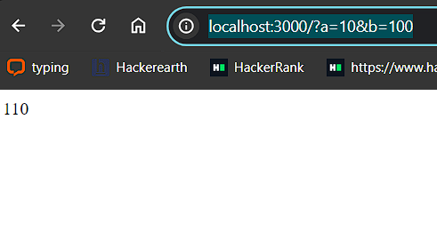

# Express Sum API
## Overview
This repository contains two Express.js applications:

1. **Sum Server(index.js)**: A simple API for calculating the sum of two numbers.
2. **Hospital Server**: An application related to hospital operations (no. of healthy/unhealthy kidneys does a patient have).
## Installation
1. Clone this repository.
2. Install dependencies with npm install.
## Example

